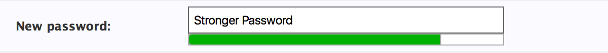

# Django Password Strength

An extension of the Django password widget including password warnings and suggestions, a password strength meter, 
and hypothetical crack times. Powered by [zxcvbn](https://github.com/lowe/zxcvbn).

### Screenshots

**Weak Passwords**

**OK Passwords**

**Strong Passwords**

### Install
`> pip install django-password-strength`

### Usage

* Add `django_password_strength` to the installed apps of your Django Project.
* Instead of using the django `PasswordInput` widget use the `PasswordStrengthInput`.
* Be sure to include the form's required media in the template. _ie._ `{{ form.media }}`. If you bundle your js you can use `django_password_strength/js/zxcvbn.js` and 
`django_password_strength/js/password_strength.js` instead.
* To use the password strength meter you must include either Bootstrap or jQueryUI.

### Bootstrap (Optional)

Bootstrap can be found [here](http://getbootstrap.com/). It's used for:

* Styling the warning and info labels css classes: 'label', 'label-danger', 'label-warning', and 'text-muted'. 
While you can create these styles yourself, they are included in bootstrap's CSS. You can find implementations of the 
styles in the advanced example, if you prefer not to include bootstrap.
* The password meter widget uses Bootstrap by default. However, it does optionally support JQueryUI instead.

### jQueryUI (Optional)

jQueryUI can be found [here](https://jqueryui.com/). It's used for:

* The password meter widget can be setup to use JQueryUI. To do so you must pass the `ProgressBarUI` object the style
`Styles.jQueryUI`, when instantiating the `PasswordStrengthInputSettings` object. You can see this demonstrated in the 
advanced example below.

### Translations

There are currently no translations already available, but all the text is translatable, 
you just have to translate it yourself.

For the javascript translations be sure to add the javascript translation catalog [provided by django]
(https://docs.djangoproject.com/en/1.7/topics/i18n/translation/#using-the-javascript-translation-catalog) or use 
something like [django-statici18n](https://github.com/zyegfryed/django-statici18n) for a static version of the 
catalog. If you don't want translations you don't have to add the catalog to your page.

### Simple Example

The simplest use case is not specifying the settings parameter for the PasswordStrengthInput widget. Note that in 
this example, Twitter Bootstrap is included (its styles and progress bar widget are used).

_forms.py_

    from django import forms
    from django_password_strength.widgets import PasswordStrengthInput, PasswordConfirmationInput

    new_password = fields.CharField(widget=PasswordStrengthInput())
    confirm_password = fields.CharField(widget=PasswordConfirmationInput(confirm_with='new_password'))
    
This results in only displaying a message about how long the password would take to crack, seen below:

In this screenshot the strength bar fills its parent div, by default. To have the width of the div and password text
entry field be the same, the width property would have to be specified for the ProgressBar (an example of that can be
seen below) or the width would have to be removed from the password input field.

### Multiple Password Fields Example

_forms.py_

    from django import forms
    from django_password_strength.widgets import PasswordStrengthInput, PasswordConfirmationInput
    
    class SignupForm(forms.Form):
        username = forms.CharField()
        passphrase = forms.CharField(
            widget=PasswordStrengthInput()
        )
        confirm_passphrase = forms.CharField(
            widget=PasswordConfirmationInput(confirm_with='passphrase')
        )

        passphrase2 = forms.CharField(
            widget=PasswordStrengthInput()
        )
        confirm_passphrase2 = forms.CharField(
            widget=PasswordConfirmationInput(confirm_with='passphrase2')
        )

### Advanced Example

The screenshots at the top of this README are taken of a form generated with these field and widget definitions. Note
that this does not include Bootstrap directly, but does include JQueryUI. Some CSS from Bootstrap is used, and can be 
seen, included, below.

_forms.py_

    from django import forms
    from django_password_strength.widgets import PasswordStrengthInput, PasswordConfirmationInput
    
    new_password = fields.CharField(
        widget=PasswordStrengthInput(
            settings=PasswordStrengthInputSettings(
                show_strength_message=False,
                strength_bar_ui=ProgressBarUI(
                    ProgressBarUI.Styles.jQueryUI, height="10px", width="310px", rounded_corners=False),
                show_warning_message=True,
                show_suggestions=True,
                min_score=2))
    )
    
    confirm_password = fields.CharField(
        widget=PasswordConfirmationInput(confirm_with='new_password')
    )
    
The form generated in the above screenshots includes some CSS from Bootstrap, which you may want to add to achieve this
look and feel (if Bootstrap isn't already in your project).

    .text-muted {
      color: #777;
      margin: 0;
    }
    
    .label {
      border-radius: 0.25em;
      color: #fff;
      display: inline;
      font-size: 75%;
      font-weight: 700;
      line-height: 1;
      padding: 0.2em 0.6em 0.3em;
      text-align: center;
      vertical-align: baseline;
      white-space: nowrap;
    }
    
    .label-danger {
      background-color: #d9534f;
    }
    
    .label-warning {
      background-color: #f0ad4e;
    }
